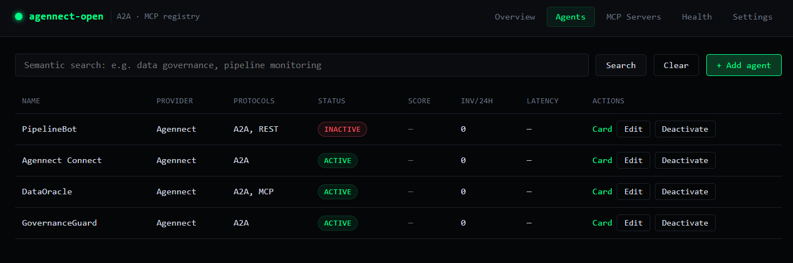

# agennect-open

Self-hosted A2A (Agent-to-Agent) registry with an MCP (Model Context Protocol)
server directory. Runs as a single Docker container, persists to SQLite,
and ships a vanilla HTML dashboard.



This is the open-source core of [Agennect](https://agennect.com). Use it to
publish, discover, and proxy agents that speak Google's A2A protocol, and to
maintain a directory of MCP servers your agents can call.

---

## Features

- **A2A registry** — every agent gets a `.well-known/agent.json` Agent Card.
- **MCP directory** — list and discover Model Context Protocol servers.
- **Semantic search** — vector search over agent name, description,
  and capabilities using `sqlite-vec`.
- **A2A proxy** — `POST /agents/:id/tasks` forwards to the agent's REST
  endpoint, logging every invocation.
- **Background health checks** — periodic GET pings to each agent's
  endpoint; status auto-flips between `active`, `degraded`, `inactive`.
- **KPI metrics** — registry-wide and per-agent counters at `/metrics`.
- **Pluggable embeddings** — Anthropic/Voyage, OpenAI, or Ollama.
- **Zero external services** — one container, one SQLite file, no Redis,
  no Postgres, no Cloudflare.

---

## Quick start

```bash
cp .env.example .env       # then edit ANTHROPIC_API_KEY and ADMIN_TOKEN
docker compose up --build
# in another terminal, seed sample data:
ADMIN_TOKEN=$(grep ADMIN_TOKEN .env | cut -d= -f2) node scripts/seed.js
open http://localhost:3000/dashboard
```

Without Docker:

```bash
npm install
cp .env.example .env
npm start
npm run seed
```

---

## API versioning

Every route is mounted at both the canonical `/v1` prefix and the
top-level unversioned path. New consumers should use `/v1`. The
unversioned aliases are kept for backward compat with the dashboard,
seed script, and earlier README examples.

```bash
curl http://localhost:3000/v1/metrics
curl http://localhost:3000/metrics      # same response
```

## OpenAPI spec

The full surface is described in `docs/openapi.yaml` (OpenAPI 3.1) and
served by the registry itself:

| Path              | Format                                    |
|-------------------|-------------------------------------------|
| `/openapi.yaml`   | Raw YAML (the authored form)              |
| `/openapi.json`   | Same spec parsed to JSON                  |

Paste the URL into Swagger UI, Stoplight, Postman, or any OpenAPI-aware
client to generate SDKs or browse the API interactively.

```bash
curl http://localhost:3000/openapi.json | jq '.paths | keys'
```

## Webhooks

The registry can POST signed JSON to one or more URLs whenever an
auditable event happens. Events match the audit log's action names:
`agent.create`, `agent.update`, `agent.delete`, `mcp.create`,
`mcp.update`, `mcp.delete`, `token.create`, `token.revoke`,
`webhook.create`, `webhook.delete`, or `*` for all of the above.

### Register a webhook

```bash
curl -X POST http://localhost:3000/admin/webhooks \
  -H "Authorization: Bearer $ADMIN_TOKEN" \
  -H "Content-Type: application/json" \
  -d '{
    "name": "ops-slack-bridge",
    "url":  "https://your.service/agennect-hook",
    "events": ["agent.create", "agent.delete"]
  }'
# → { "id": "...", "secret": "whsec_…", "warning": "Shown exactly once" }
```

### Payload + signature

The receiver gets a `POST` with this body:

```json
{
  "id": "<uuid>",
  "event": "agent.create",
  "delivered_at": "2026-06-22T14:00:00.000Z",
  "data": {
    "actor": "env-bootstrap",
    "target_type": "agent",
    "target_id": "dataoracle-abcd",
    "before": null,
    "after": { "name": "DataOracle", "provider": "Agennect", "status": "active" }
  }
}
```

And this header:

```
X-Agennect-Signature: t=1719060000,v1=<hex>
```

To verify: compute `HMAC-SHA256(sha256(secret), t + "." + rawBody)` and
compare against `v1` in constant time. Node:

```js
import { createHash, createHmac, timingSafeEqual } from 'crypto';

function verify(rawBody, sigHeader, secret) {
  const parts = Object.fromEntries(sigHeader.split(',').map(p => p.split('=')));
  const key = createHash('sha256').update(secret).digest('hex');
  const expected = createHmac('sha256', key).update(`${parts.t}.${rawBody}`).digest('hex');
  return timingSafeEqual(Buffer.from(expected, 'hex'), Buffer.from(parts.v1, 'hex'));
}
```

Deliveries are fire-and-forget with a 5s timeout. Errors are recorded
on the webhook row (`last_status`, `last_error`, `failure_count`); the
mutation that triggered the event always succeeds even if delivery fails.

---

## Users, SSO & ownership

agennect-open supports two parallel ways to authenticate, both
issuing the same kind of bearer token:

1. **API tokens** — minted via `POST /admin/tokens`, used by CI bots,
   service accounts, and the dashboard's "paste a token" flow. These
   have a `scope` (`read | write | admin`) but no user identity.
2. **User sessions via external SSO** — humans sign in through an
   external identity provider (Firebase Auth today; pluggable).
   The dashboard exchanges the provider ID token for a session token
   tied to a row in the `users` table.

### Ownership model

Every `agent` and `mcp_server` row has an `owner_user_id`. Mutation
rules are:

| Actor                              | Mutate own resource | Mutate others' |
|------------------------------------|---------------------|----------------|
| `role = 'user'`                    | ✓                   | ✗ (403)        |
| `role = 'admin'`                   | ✓                   | ✓              |
| env-bootstrap (no user record)     | ✓                   | ✓              |

All pre-Sprint-5 rows are owned by a synthetic `system` user; only
admins can mutate them until reassigned.

### Setting up Firebase Auth

1. Create a Firebase project, enable Google sign-in (or any provider).
2. Copy the project's web API key + project id into `.env`:
   ```
   AUTH_PROVIDER=firebase
   FIREBASE_PROJECT_ID=my-project
   FIREBASE_API_KEY=AIza...
   ADMIN_EMAILS=alice@example.com,bob@example.com
   ```
3. Add your registry URL (e.g. `http://localhost:3000`) to the Firebase
   project's "Authorized domains" list (Authentication → Settings).
4. Restart the server. Open the dashboard → Settings tab → **Sign in
   with Google**.
5. First login of an email listed in `ADMIN_EMAILS` provisions an admin
   user; everyone else gets the `user` role.

### Adding another provider

Implement `verifyIdToken(idToken)` in `src/auth-providers/<name>.js`,
register it in `src/auth-providers/index.js`, then point
`AUTH_PROVIDER` at it. The rest of the codebase doesn't change.

### Managing users from the dashboard

Admins get a **Users** tab listing every user with their email, role,
provider, last-login, owned-agent count, and an Actions column for
Promote/Demote and Disable/Enable. Both actions immediately revoke that
user's open session tokens, so the new state takes effect on their next
request. The synthetic `system` user (legacy data) is not modifiable.

### Managing webhooks from the dashboard

Admins also get a **Webhooks** tab with the registered subscribers,
their last delivery status (color-coded), failure counter, and per-row
**Test / Pause / Resume / Delete** actions. The Test button fires a
synthetic `webhook.test` event so receivers can verify wiring without
having to wait for a real mutation. Paused webhooks skip delivery
entirely until resumed.

### Auth endpoints

| Method | Path                | Description                                |
|--------|---------------------|--------------------------------------------|
| GET    | `/auth/config`      | Public client config for the active provider |
| POST   | `/auth/login`       | `{ id_token }` → session token + user      |
| GET    | `/auth/me`          | Current token + user                       |
| POST   | `/auth/logout`      | Revoke the current session token           |

---

## Authentication & authorization

Every write endpoint requires a Bearer token. Tokens live in the `tokens`
table (hashed SHA-256, plaintext shown exactly once on creation) and have
one of three scopes:

| Scope    | Allowed                                                                 |
|----------|-------------------------------------------------------------------------|
| `read`   | All public GET endpoints (most don't need auth at all)                  |
| `write`  | `read` + POST/PUT/DELETE on `/agents` and `/mcp`                        |
| `admin`  | `write` + everything under `/admin` (token management, audit log)        |

### Bootstrap

On first boot, `process.env.ADMIN_TOKEN` is automatically registered as an
`admin`-scope token (name `env-bootstrap`). That preserves the dashboard
workflow: paste the env value, get admin access. Rotating the env var on a
restart updates the bootstrap row's hash to match.

### Managing tokens

```bash
# Mint a write-scope token (must come from an admin)
curl -X POST http://localhost:3000/admin/tokens \
  -H "Authorization: Bearer $ADMIN_TOKEN" \
  -H "Content-Type: application/json" \
  -d '{"name": "ci-bot", "scope": "write"}'
# → { "id": "...", "name": "ci-bot", "scope": "write", "token": "agk_…", "warning": "…" }

# List token metadata (never the value)
curl http://localhost:3000/admin/tokens -H "Authorization: Bearer $ADMIN_TOKEN"

# Soft-revoke a token
curl -X DELETE http://localhost:3000/admin/tokens/{id} \
  -H "Authorization: Bearer $ADMIN_TOKEN"
```

### Audit log

Every successful mutation under `/agents`, `/mcp`, and `/admin/tokens`
writes an append-only row to `audit_log` with actor, action, before/after,
and IP. Read it back:

```bash
curl "http://localhost:3000/admin/audit?limit=50&action=agent.create" \
  -H "Authorization: Bearer $ADMIN_TOKEN"
```

---

## Configuration

All settings come from environment variables (see `.env.example`).

| Variable                | Default                         | Description                                                                                       |
|-------------------------|---------------------------------|---------------------------------------------------------------------------------------------------|
| `PORT`                  | `3000`                          | Port the HTTP server listens on.                                                                  |
| `HOST`                  | `0.0.0.0`                       | Bind address.                                                                                     |
| `REGISTRY_NAME`         | `My Agent Registry`             | Display name shown in `/metrics` and the dashboard.                                               |
| `REGISTRY_URL`          | `http://localhost:3000`         | Public URL used in generated Agent Cards.                                                         |
| `DB_PATH`               | `./data/registry.db`            | SQLite path. Mount this volume in Docker.                                                         |
| `LLM_PROVIDER`          | `anthropic`                     | Embedding provider: `anthropic` (Voyage), `openai`, or `ollama`.                                  |
| `EMBEDDING_MODEL`       | `voyage-3`                      | Provider-specific embedding model.                                                                |
| `EMBEDDING_DIMS`        | `1024`                          | Must match the model: voyage-3 → 1024, text-embedding-3-small → 1536, nomic-embed-text → 768.    |
| `ANTHROPIC_API_KEY`     | —                               | Required when `LLM_PROVIDER=anthropic`. Used for the Voyage embeddings endpoint.                  |
| `OPENAI_API_KEY`        | —                               | Required when `LLM_PROVIDER=openai`.                                                              |
| `OLLAMA_URL`            | `http://localhost:11434`        | Required when `LLM_PROVIDER=ollama`.                                                              |
| `ADMIN_TOKEN`           | `change-me-before-deploy`       | Auto-registered as the bootstrap `admin`-scope token (name `env-bootstrap`). Change it.            |
| `CORS_ORIGINS`          | `*`                             | Comma-separated allowlist of origins, or `*` for any. Replace `*` before exposing to the internet. |
| `HEALTH_CHECK_INTERVAL` | `300000`                        | Health check loop interval in ms.                                                                 |

---

## API reference

### Public

| Method | Path                                     | Description                                  |
|--------|------------------------------------------|----------------------------------------------|
| GET    | `/health`                                | Liveness probe.                              |
| GET    | `/metrics`                               | Global registry KPIs.                        |
| GET    | `/metrics/agents/:id`                    | Per-agent KPIs.                              |
| GET    | `/agents`                                | List agents. Query: `status`, `protocol`, `hosting`, `page`, `limit`. |
| GET    | `/agents/search?q=`                      | Semantic search by natural language.         |
| GET    | `/agents/:id`                            | Agent detail with capabilities.              |
| GET    | `/agents/:id/.well-known/agent.json`     | A2A Agent Card (schema v0.2).                |
| GET    | `/agents/:id/health`                     | Health checks for the last 24h.              |
| POST   | `/agents/:id/tasks`                      | A2A task entry point. Logged as invocation.  |
| GET    | `/mcp`                                   | List MCP servers. Query: `category`, `transport`. |
| GET    | `/mcp/:id`                               | MCP server detail with tools.                |

### Write-scope (require a `write`- or `admin`-scope token)

| Method | Path                  | Description                                  |
|--------|-----------------------|----------------------------------------------|
| POST   | `/agents`             | Register an agent. Generates embedding + card. |
| PUT    | `/agents/:id`         | Update agent. Re-embeds if name/description/capabilities change. |
| DELETE | `/agents/:id`         | Soft-delete (`status=inactive`).             |
| POST   | `/mcp`                | Register an MCP server.                      |
| PUT    | `/mcp/:id`            | Update an MCP server.                        |
| DELETE | `/mcp/:id`            | Soft-delete an MCP server.                   |

### Admin-scope (require an `admin`-scope token)

| Method | Path                              | Description                                |
|--------|-----------------------------------|--------------------------------------------|
| POST   | `/admin/tokens`                   | Mint a new token (returns plaintext once). |
| GET    | `/admin/tokens`                   | List tokens (metadata only — no value).    |
| DELETE | `/admin/tokens/:id`               | Soft-revoke a token.                        |
| GET    | `/admin/audit`                    | Read audit log (filters: action, target_type, target_id, limit). |
| GET    | `/admin/users`                    | List users with owned-resource counts.     |
| PUT    | `/admin/users/:id`                | Change role (`user`/`admin`) or disable/enable. Auto-revokes the user's sessions. |
| POST   | `/admin/webhooks`                 | Register a webhook (returns plaintext secret once). |
| GET    | `/admin/webhooks`                 | List webhooks with delivery stats.         |
| PUT    | `/admin/webhooks/:id`             | Pause or resume delivery (`{paused: true/false}`). |
| POST   | `/admin/webhooks/:id/test`        | Fire a synthetic `webhook.test` event to this subscriber. |
| DELETE | `/admin/webhooks/:id`             | Delete a webhook.                          |

### Meta

| Method | Path             | Description                          |
|--------|------------------|--------------------------------------|
| GET    | `/openapi.yaml`  | Authored OpenAPI 3.1 spec (YAML).    |
| GET    | `/openapi.json`  | Same spec, served as JSON.           |
| GET    | `/llms.txt`      | Concise, LLM-readable API summary.   |

---

## Operations

### Structured logging

The server logs JSON lines to stdout (one parseable object per line) and
echoes a unique `X-Request-Id` header on every response so you can trace
a single request through the logs. Override via env:

- `LOG_LEVEL=debug|info|warn|error` (default `info`)
- `LOG_PRETTY=1` switches to a human-readable single-line format
  (default in dev / when `NODE_ENV != production`)

Clients can pass their own `X-Request-Id` header and the server will
honor it instead of minting one.

### Mock embeddings for CI / offline dev

Set `LLM_PROVIDER=mock` to use a deterministic bag-of-words embedder
that needs no API key. Same text always produces the same vector; texts
sharing tokens cluster under cosine distance. Used by `.github/workflows/test.yml`
so the semantic-search integration tests run hermetically.

### Dashboard theme

Toggle in the topbar (◐ for dark / ☾ for light); choice persists in
localStorage. Default is dark.

### Reporting a vulnerability

See [SECURITY.md](SECURITY.md). Contributions: [CONTRIBUTING.md](CONTRIBUTING.md).

### A2A invocation

The caller may pass `X-Agent-Auth: <value>` to forward an API key or OAuth
token to the upstream agent endpoint. The registry never persists this value.
See **Invocation Modes** below for the two ways callers can drive an agent.

---

## Invocation Modes

agennect-open supports two modes for tracking agent invocations.

### Mode B — SDK (default, recommended)

Your orchestrator (or calling agent) invokes the target agent **directly**
and reports metrics to the registry afterwards. Zero added latency,
no single point of failure, no registry restart pain.

#### JavaScript / Node.js

```js
import { AgennectReporter } from './src/sdk/reporter.js';

const reporter = new AgennectReporter('http://localhost:3000', {
  callerId: 'my-orchestrator'
});

const { invoke } = reporter.wrap('dataoracle-x7k2');

try {
  const { result, latency_ms } = await invoke(
    'https://myagent.com/tasks',
    { message: { parts: [{ type: 'text', text: 'Analyze Q1 data' }] } }
  );
  console.log(`Done in ${latency_ms}ms`, result);
} catch (e) {
  console.error('Invocation failed:', e.message);
}
```

Or report metrics for an invocation you handled yourself:

```js
await reporter.report('dataoracle-x7k2', {
  latency_ms: 340,
  status: 'success',
  request_size: 512,
  response_size: 1024
});
```

#### Python

```python
from reporter import AgennectReporter

reporter = AgennectReporter(
    "http://localhost:3000", caller_id="my-orchestrator"
)

result = reporter.invoke(
    agent_id="dataoracle-x7k2",
    endpoint_url="https://myagent.com/tasks",
    payload={"message": {"parts": [
        {"type": "text", "text": "Analyze Q1 data"}
    ]}}
)
```

Both SDKs **fire-and-forget** the report — the caller never blocks on
registry availability.

### Mode A — Proxy (opt-in per agent)

The registry forwards the A2A task to the agent's endpoint, measures
everything, logs it, and returns the A2A response. Useful when the caller
can't or won't import the SDK, or when you want central auth fan-out.

Enable per-agent via the admin API:

```bash
curl -X PUT http://localhost:3000/agents/{id} \
  -H "Authorization: Bearer $ADMIN_TOKEN" \
  -H "Content-Type: application/json" \
  -d '{"proxy_enabled": true}'
```

Then invoke through the registry:

```bash
curl -X POST http://localhost:3000/agents/{id}/tasks \
  -H "Content-Type: application/json" \
  -H "X-Agent-Auth: your-agent-api-key" \
  -d '{"message":{"role":"user","parts":[{"type":"text","text":"Analyze Q1"}]}}'
```

The response embeds an `_agennect` block with the invocation id and
latency. If `proxy_enabled` is false, `POST /agents/:id/tasks` returns
`422` with a hint pointing to `/agents/:id/report`.

---

## A2A protocol

Agent Cards conform to the Google A2A spec (`schema_version: 0.2`). Each card
exposes the agent's id, capabilities, authentication scheme, supported
input/output modes, and the task URL on this registry:

- Spec: <https://github.com/google/A2A>
- Card: `GET /agents/:id/.well-known/agent.json`

The registry acts as an A2A endpoint for every agent it knows about. Cards
point at this registry's URL — callers don't need to know the underlying
endpoint or auth requirements. Auth is forwarded per-request via `X-Agent-Auth`.

---

## MCP directory

The MCP directory is a catalog of Model Context Protocol servers your agents
can connect to. The registry does not host MCP servers — it lists them, with
their transport (stdio/http/sse), config URL, tool schema, and author.

- MCP spec: <https://modelcontextprotocol.io>
- Browse: `GET /mcp`
- Detail: `GET /mcp/:id` returns the full tools array.

---

## The Connect Agent

The registry ships with one built-in agent: **Agennect Connect**
(`id: agennect-connect`). It's a normal entry in `/agents` — searchable,
has an Agent Card at `/agents/agennect-connect/.well-known/agent.json`,
shows up in the dashboard — but its `is_builtin` flag tells the invoke
router to dispatch `POST /agents/agennect-connect/tasks` to an in-process
handler instead of fetching an `endpoint_url`. Skips the health-check loop
for the same reason.

### What it does

Walks a caller through registering a new agent via A2A conversation,
validates each field, and creates the agent (owned by whoever's session
is making the request) using the same SQL the `POST /agents` route uses.

### Two engines

1. **LLM extractor (when configured)** — calls the chat provider chosen
   by `LLM_PROVIDER` via `src/chat.js`, using structured tool-use so the
   output is a strict JSON shape. The model pulls fields from free-form
   input ("I want to register an agent called PipelineBot that does ELT
   and dbt") and decides the next prompt. Supported providers:
   `anthropic` (Claude via tool use), `openai` (function calling),
   `ollama` (`format: json`). Configure the model via `CHAT_MODEL` env
   (defaults: `claude-haiku-4-5-20251001`, `gpt-4o-mini`, `llama3.1`).
2. **Rule-based state machine (always available)** — deterministic
   walk: `name → description → provider → endpoint → capabilities →
   review → submit`. Used as a fallback when the LLM path returns
   `null` (no API key, `LLM_PROVIDER=mock`, or a network failure).

### Using it via A2A

```bash
SESS=demo-$(date +%s)

curl -X POST http://localhost:3000/agents/agennect-connect/tasks \
  -H "Authorization: Bearer $ADMIN_TOKEN" \
  -H "Content-Type: application/json" \
  -d "$(jq -nc --arg s "$SESS" '{
    id: $s,
    message: {role:"user", parts:[{type:"text", text:""}]},
    context: { session_id: $s }
  }')"
# → bot: "Want me to help you register an agent or an MCP server?"

# Each subsequent turn re-uses the same session_id; the bot remembers
# what you've answered so far.
```

### Using it from the dashboard

Click the floating **💬 Connect** button (bottom right) to open a chat
panel. It stores its `session_id` in `sessionStorage`; the ↻ button
starts a new session.

### Env vars

| Variable        | Default                          | Notes                                                      |
|-----------------|----------------------------------|------------------------------------------------------------|
| `LLM_PROVIDER`  | `anthropic`                      | Same env as embeddings: `anthropic`/`openai`/`ollama`/`mock`. |
| `CHAT_MODEL`    | provider default (above)         | Override the chat model.                                   |
| `ANTHROPIC_API_KEY` | —                            | Required for `anthropic` chat (real Claude API key).       |
| `OPENAI_API_KEY`    | —                            | Required for `openai` chat.                                |
| `OLLAMA_URL`        | `http://localhost:11434`     | Required for `ollama`.                                     |

With `LLM_PROVIDER=mock`, the Connect Agent runs the state machine end
to end — useful for offline dev and CI.

---

## Self-hosted vs Agennect Cloud

| Feature                          | agennect-open (this repo) | Agennect Cloud         |
|----------------------------------|---------------------------|------------------------|
| A2A registry + Agent Cards       | ✓                         | ✓                      |
| MCP directory                    | ✓                         | ✓                      |
| Semantic search                  | ✓ (sqlite-vec)            | ✓ (managed vectors)    |
| Health checks                    | ✓                         | ✓                      |
| Single-container deploy          | ✓                         | —                      |
| Managed hosting                  | —                         | ✓                      |
| Multi-tenant orgs & RBAC         | —                         | ✓                      |
| Evals / quality scoring          | —                         | ✓                      |
| SSO                              | —                         | ✓                      |
| Hosted agents (no infra of yours) | —                        | ✓                      |
| Source available                 | MIT (this repo)           | proprietary            |

If you need single-org self-hosting on commodity infra, use this repo. If you
need multi-tenant, hosted, or evaluation features, use the cloud.

---

## Contributing

- File issues and PRs at <https://github.com/agennect/agennect-open>.
- To run the integration tests:
  ```bash
  npm start &      # in one terminal
  npm test         # in another
  ```
- To submit a new agent for the public catalog at agennect.com, open a PR with
  your agent's metadata in `seed.js`-format, or use the Agennect Connect
  onboarding agent.

---

## License

MIT — see `LICENSE`.
